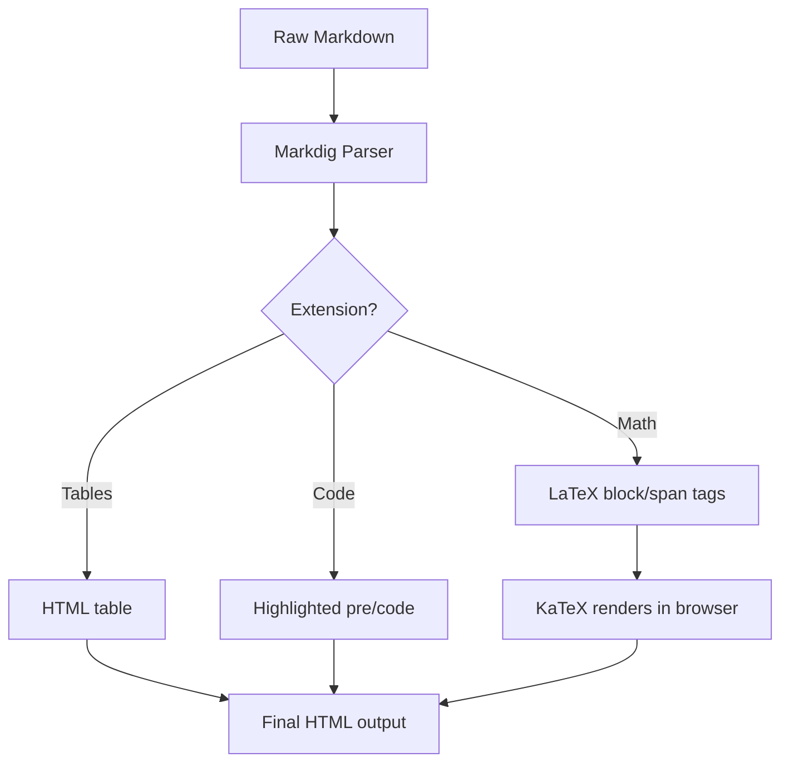

# Markdig Advanced Features Tests


## 1. Mathematics

### Inline Math
The quadratic formula is $x = \frac{-b \pm \sqrt{b^2 - 4ac}}{2a}$ and Euler's identity is $e^{i\pi} + 1 = 0$.

### Block Math (align)
$$
\begin{align}
f(x) &= ax^2 + bx + c \\
     &= a\left(x + \frac{b}{2a}\right)^2 - \frac{b^2}{4a} + c
\end{align}
$$

### Block Math (matrix)
$$
A = \begin{pmatrix}
  a_{11} & a_{12} & a_{13} \\
  a_{21} & a_{22} & a_{23} \\
  a_{31} & a_{32} & a_{33}
\end{pmatrix}
$$

### Block Math (integral)
$$
\int_{-\infty}^{\infty} e^{-x^2}\,dx = \sqrt{\pi}
$$

---

## 2. Tables

| Library   | Language | Math Support | License |
|-----------|----------|:------------:|---------|
| Markdig   | C#       | ✓            | BSD-2   |
| marked    | JS       | via plugin   | MIT     |
| Pandoc    | Haskell  | ✓            | GPL-2   |
| goldmark  | Go       | via plugin   | MIT     |

---

## 3. Task Lists

- [x] Set up Markdig pipeline
- [x] Enable `UseMathematics()` extension
- [x] Add KaTeX script to page `<head>`
- [ ] Write unit tests
- [ ] Deploy to production

---

## 4. Footnotes

Markdig supports footnotes[^1] that render as superscripts and collect at the bottom[^2].

[^1]: This is the first footnote. It can contain **formatted** text.
[^2]: Footnotes are great for citations and asides without cluttering the main text.

---

## 5. Definition Lists

Markdig
:   A fast, extensible CommonMark-compliant Markdown processor for .NET.

KaTeX
:   A fast LaTeX math rendering library for the browser, developed by Khan Academy.

MathJax
:   A JavaScript display engine for LaTeX, MathML and AsciiMath that works in all browsers.

---

## 6. Abbreviations

Markdig is compatible with the CommonMark spec. It also supports GFM extensions.

*[CommonMark]: A strongly defined, highly compatible specification of Markdown
*[GFM]: GitHub Flavored Markdown

---

## 7. Figures & Images with Attributes

{ width=600 }

---

## 8. Code Blocks with Syntax Highlighting

### C#
```csharp
var pipeline = new MarkdownPipelineBuilder()
    .UseAdvancedExtensions()
    .UseMathematics()
    .Build();

string html = Markdown.ToHtml(markdownSource, pipeline);
```

### TypeScript
```typescript
export function renderMarkdownInto(
  markdown: string,
  target: string | HTMLElement,
  options: RenderOptions = {}
): void {
  const el = typeof target === "string"
    ? document.querySelector<HTMLElement>(target)!
    : target;
  el.innerHTML = renderMarkdown(markdown, options);
}
```

### Shell
```bash
dotnet add package Markdig
npm install katex
```

---

## 9. Blockquotes & Nested Quotes

> Mathematics is the language with which God has written the universe.
>
> — *Galileo Galilei*
>
> > Nested quote: pure mathematics is, in its way, the poetry of logical ideas.
> >
> > — *Albert Einstein*

---

## 10. Strikethrough & Smart Typography

~~This approach is deprecated~~ — use `UseMathematics()` instead.

Markdig handles smart quotes: "double" and 'single', em-dashes --- and ellipses...

---

## 11. Superscript & Subscript

Water is H~2~O. Einstein's famous equation is E = mc^2^.

The general term of a geometric series is $a_n = a_1 \cdot r^{n-1}$.

---

## 12. Custom Containers (callouts)

:::warning
**Warning:** Always sanitize the HTML output of any Markdown renderer before
inserting it into the DOM to prevent XSS attacks.
:::

:::tip
**Tip:** Use `fullDocument: false` (the default) when injecting into an existing
`<div>` — you only need the HTML fragment, not a full `<!DOCTYPE html>` page.
:::

---

## 13. Diagrams (Mermaid)



---

## 14. Setext-style Heading & Horizontal Rules

Alternate Heading Style
=======================

Three styles of horizontal rule:

---
***
___

---

## 15. Inline HTML

Markdig passes raw HTML through, so you can mix in native elements:

<details>
<summary>Click to expand a hidden section</summary>

This content is hidden by default. You can include **Markdown** inside `<details>` blocks
and Markdig will still render it correctly.

\[ F = ma \]

</details>